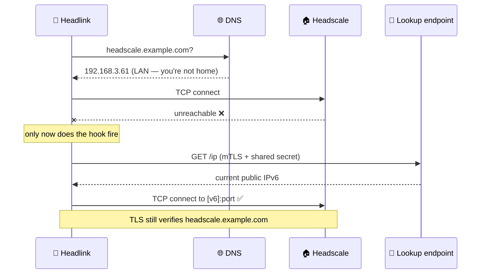

# Headlink

**A private Headscale client for Android.**
Tailscale's networking engine, pointed at your own coordination server.

**An independent fork. Not an official Tailscale application, and not affiliated with Tailscale Inc.**

---

## 🧭 What is this?

Headlink is a personal Android client for self-hosted [Headscale](https://headscale.net)
deployments, adapted from the open-source
[Tailscale Android client](https://github.com/tailscale/tailscale-android). The mesh, the
WireGuard® data plane, NAT traversal — all of that is genuinely Tailscale's, untouched. What
changed is everything that assumed you were talking to *Tailscale's* servers.

|  | |
| --- | --- |
| 📦 **Application ID** | `dev.leodeng.headlink` — installs *beside* the official app, never over it |
| 🎯 **Built for** | one Headscale server, one person, no accounts to switch between |
| 🔭 **Telemetry** | none, by construction — not a setting you can flip back on |
| 🧬 **Upstream** | [tailscale/tailscale-android](https://github.com/tailscale/tailscale-android), rebased onto, kept small |

## 🚀 Install

Grab an APK from the [latest release](https://github.com/leodenglovescode/headlink-android/releases/latest)
and open it on the phone.

> [!TIP]
> Take **`headlink-v*-arm64-v8a.apk`**. Every Android device from the last several years is arm64,
> and it is a quarter the size of the universal build. Only reach for the plain
> `headlink-v*.apk` if you genuinely don't know the architecture.

Prefer to build it yourself? `make apk` → [building guide](docs/building.md).

Then, **before connecting**, one setting that is not optional:

> [!IMPORTANT]
> **Settings → Apps → Headlink → App battery usage → Unrestricted.**
>
> Without it, Android cuts the app's network the instant it loses foreground — which is exactly
> when a VPN client needs to reconnect. Everything fails at once, DNS included, and it looks
> precisely like a broken server. This is the single most misleading failure on Android.

Finally: open Headlink, tap **Connect**, enter `https://your-headscale.example.com:port`, and
optionally a pre-auth key. That's the whole setup screen.

📖 The long version: **[Getting started](docs/getting-started.md)**.

## ✨ The feature this fork exists for

**Private Headscale IPv6 Discovery.**

Say your Headscale hostname resolves to a *private LAN address* on purpose, so your home network's
rotating public IPv6 never appears in public DNS. Lovely at home. Useless everywhere else.

Headlink fixes that without publishing anything:

The invariant that makes this safe: **the hook supplies a physical destination and nothing else.**
DNS caching resolves *above* the dial function, and the TLS dialer derives `ServerName` from the
original hostname — so SNI, certificate verification and the HTTP `Host` header all remain your
configured coordination server. The hook hands back a socket. It cannot weaken TLS even in
principle, and a test pins exactly that.

Think of it as one `/etc/hosts` line, scoped to a single connection, that keeps itself current.

## 🚫 What it does *not* do

Worth being explicit about, because these are guarantees rather than defaults:

- ❌ **No telemetry.** Upstream points logtail at `log.tailscale.io`; here it is disabled *and* its
  HTTP transport fails every request without dialing. Two independent mechanisms, because one of
  them used to be a setting. The Settings switch is gone — a control that cannot change anything
  can only mislead.
- ❌ **No polling.** No alarms, no WorkManager jobs, no background timers. A lookup happens only
  when a real dial actually fails.
- ❌ **No relaying.** Peer traffic never passes through any of this; magicsock owns its own UDP
  sockets, exactly as upstream.
- ❌ **No Google DNS fallback.** Upstream defaults it on; here it is off. A client built to keep a
  home network's addressing private must not fail open to someone else's resolver.
- ❌ **No `InsecureSkipVerify`, ever.** Credentials live in Android Keystore AES-256-GCM, never in
  plain preferences, never in logs, never in exception text. The discovered IPv6 address is never
  logged — it's the whole thing being protected.

## 🔀 What changed from upstream

| | |
| --- | --- |
| ➕ **Added** | Private Headscale IPv6 Discovery · mutual-TLS lookup client · Headscale server setup screen |
| ➖ **Removed** | account switcher · alternate-server menu · Mullvad exit-node screens · delete-tailnet · separate auth-key screen · the telemetry toggle |
| 🔁 **Changed** | Headlink branding · `CorpDNS` off by default (Headscale rarely runs MagicDNS) · Google DNS fallback off · logtail hard-disabled |

Server setup is a single screen — address, optional auth key — reachable from Settings and from
the logged-out main screen, and it is also where **Log out** lives.

## 📚 Documentation

| | |
| --- | --- |
| 🏁 [**Getting started**](docs/getting-started.md) | Install, connect, and optionally set up IPv6 discovery |
| 🔐 [**Private Headscale IPv6 Discovery**](docs/private-headscale-ipv6-discovery.md) | Architecture, why TLS identity is preserved by construction, security model, limits |
| 🛠️ [**Building**](docs/building.md) | Toolchain, Docker and Nix paths, every make target |
| 🐛 [**FAQ and quirks**](docs/faq.md) | The Android, build and deployment behaviour that costs you an afternoon if you meet it cold |
| 🧱 [**AGENTS.md**](AGENTS.md) | Maintenance rules, rebase-fragile touch points, invariants that must not regress |

🍿 A few things that have genuinely wasted an afternoon

 

- Battery optimisation silently killing the app's network, presenting as a server outage.
- `adb install` installs for **every** Android user; `adb uninstall` removes only user 0. A stale
  debug-signed copy hiding in a Private space makes every release-signed APK fail with
  `INSTALL_FAILED_UPDATE_INCOMPATIBLE`, long after you've uninstalled everything you can see.
- macOS `curl` uses Secure Transport, which quietly ignores `--cacert` and refuses a PEM
  `--cert`/`--key` pair. Client identities have to be PKCS#12.
- TLS 1.3 completes the handshake *before* the server checks your client certificate, so a rejected
  cert looks like a successful connection that then dies. It looks nothing like an auth failure.
- Probing the wrong port on the right host and concluding the server is misconfigured. It was a
  completely unrelated vhost.
- `logcat`'s 256 KiB default buffer discarding everything within seconds. `adb logcat -G 16M`.

All of these, in detail, live in the [FAQ](docs/faq.md).

## ⚖️ Licence and attribution

Headlink is adapted from the open-source Tailscale Android client and distributed under the same
**BSD-3-Clause** licence — see [LICENSE](LICENSE).

Portions Copyright (c) 2020 Tailscale & AUTHORS. All rights reserved.

**Headlink is not an official Tailscale application and is not affiliated with, endorsed by, or
sponsored by Tailscale Inc.** For the official client, see
[tailscale/tailscale-android](https://github.com/tailscale/tailscale-android). Please report issues
with *this* fork here, and never to Tailscale's issue tracker.

WireGuard is a registered trademark of Jason A. Donenfeld.

Built for exactly one tailnet. 🏡

